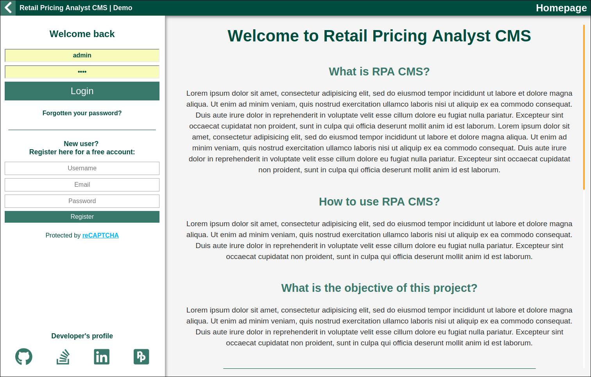

Retail Pricing Analyst (RPA)
================================================================================

<!-- TODO: Fix all CC issues

-->

Overview
--------------------------------------------------------------------------------

- Documentation: [`./documentation/README.md`](./documentation/README.md)
- Kanban board:  [RPA board](https://github.com/U-ways/RPA/projects/1)

### Heads up!
Although core backend features are complete, this project is still far from finished. I don't like publishing incomplete work, but since I am applying for internships/work-placements I need to showcase some of my recent skills.

Also, I started this project while studying software engineering practices. There are a couple of things that I am now aware of that I would like to change/improve in regards to my development workflow, documentation and architecture.

So please don't reference my code as guidance before first release and sorry for the disappointment if you came across this repository for a full maintainable solution.

**Expected first release date:** Summer 2019.

### Project description:
This is a Retail Pricing Analyst web application with a custom CMS, GraphQL API implementation, RESTful services for user actions and many cloud solutions.

### What is a retail pricing analyst application?
**For starters, let's review what does a pricing analyst do:**

> Pricing analysts look at industry standards, paying close attention to the pricing strategies of their competitors. They use mathematical analysis to track pricing trends in the marketplace using industry databases, catalogues and other industry sources. They study consumer habits to determine how much people are willing to pay for various products and to look for patterns in consumer spending.

They are also interested in many other aspects of item production. I'd advise reading this great blog post about [what makes a great pricing analyst][1].

Therefore, this ambitious project is an attempt to automate the many aspects of the retail pricing analyst workflow.

### Why a retail pricing analyst application?
This is my first back-end and full-stack applciation. I wanted something that other people can learn from and challenging at the same time. What is more to ask from a side-project that provides the opprtunity to:

- Use modern tools
- Play with numbers (statistical analysis)
- Scale (there is so much to build within a CMS)
- Force good practices and architecture (the quickest way to build software)

Checkout the [app's documentation](./documentation/README.md) for further information.

________________________________________________________________________________

[1]:https://blog.blackcurve.com/what-makes-a-great-pricing-analyst
